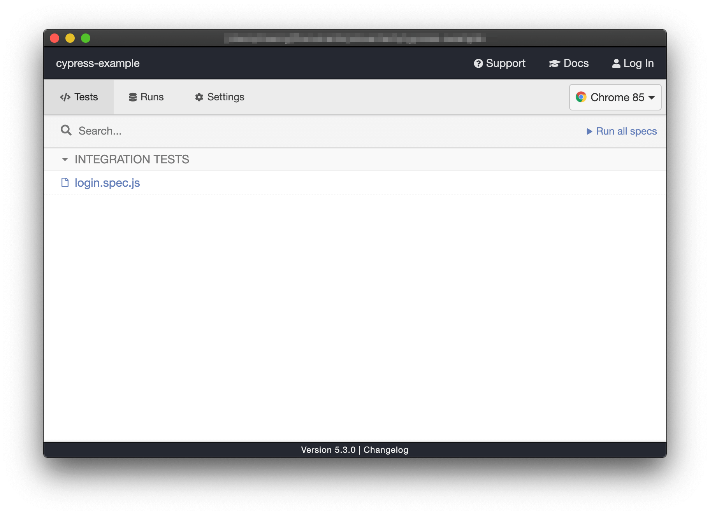
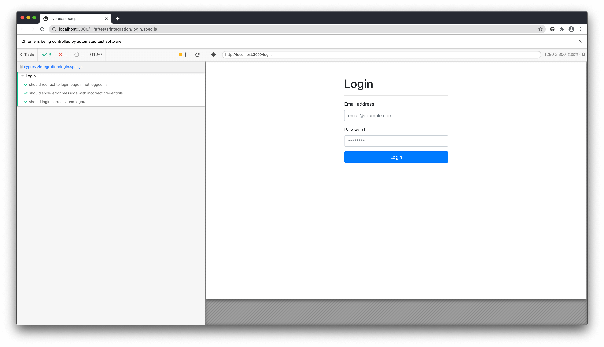
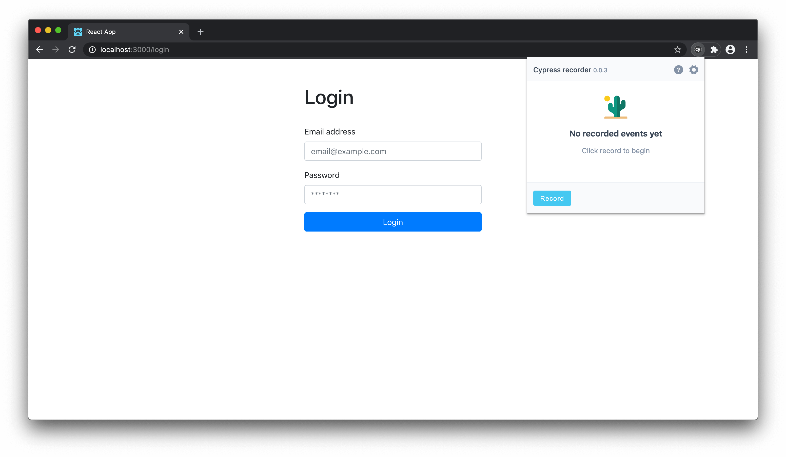
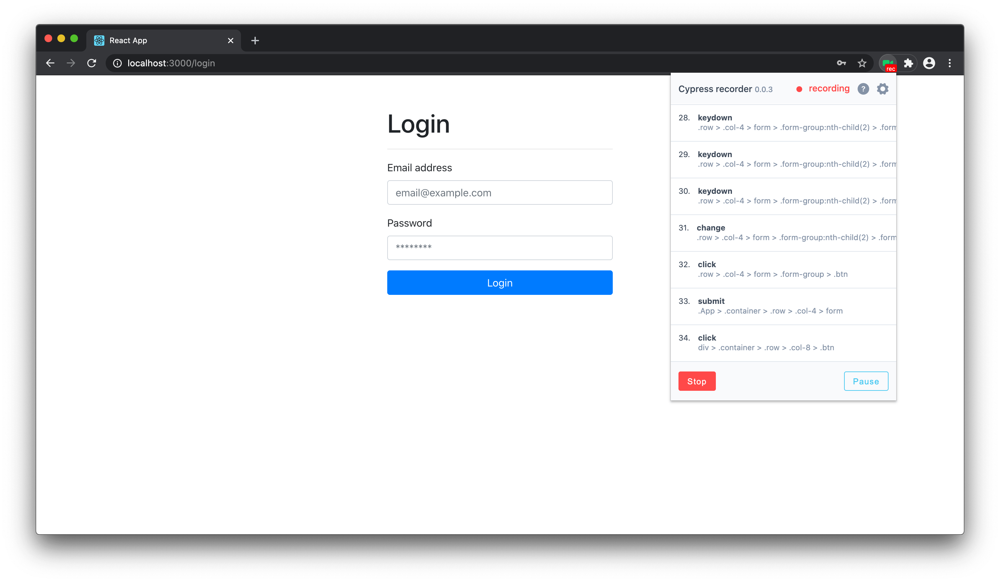
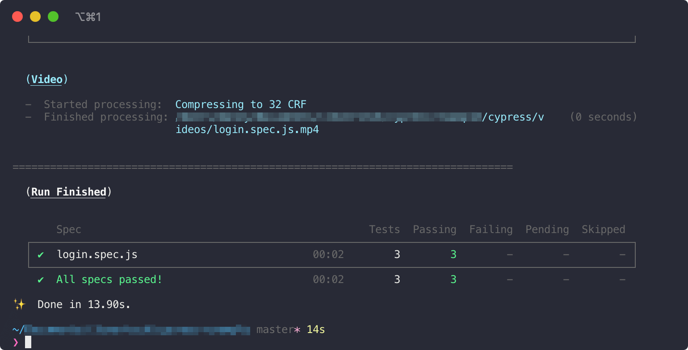

# Cypress Demo

This project is to sample to demonstrate how Cypress can be used to automate end to end testing.

For reference [Cypress.io](https://www.cypress.io)

**NOTE:** Tests between testers and programmers will need to have a convention defined to better identify and reference different types of test scenarios.

**_Example_**

> **Testing Scenario Name:** `Successfully Login & Logout`
>
> **(Optional) Description:** User is able to login with correct credentials, be redirected to dashboard, and is able to logout and be redirected back to the login screen.

---

## Table Of Contents

- [Requirements](#requirements)
- [Local Setup](#local-setup)
  - [Step 1 - Install Dependencies](#step-1---install-dependencies)
  - [Step 2 - Run Cypress Open](#step-2---run-cypress-open)
- [Creating Tests From Chrome Extension](#creating-tests-from-chrome-extension)
  - [Step 1 - Defining A Test Scenario](#step-1---defining-a-test-scenario)
  - [Step 2 - Record User Interactions](#step-2---record-user-interactions)
  - [Step 3 - Adding Test To Cypress Code](#step-3---adding-test-to-cypress-code)
- [Running CLI Tests](#running-cli-tests)

---

## Requirements

- NodeJS 10.15.3+ (or NVM)
- Yarn 1.19.2+ ([Link](https://yarnpkg.com))
- Chrome Browser
- Cypress Chrome Extension ([Link](https://chrome.google.com/webstore/detail/cypress-scenario-recorder/fmpgoobcionmfneadjapdabmjfkmfekb))

---

## Local Setup

**NOTE:** you absolutely need `yarn` for this project to run.

### Step 1 - Install Dependencies

Run:

```bash
yarn install;
```

### Step 2 - Run Cypress Open

To see the tests in action run:

```bash
yarn test:ci:e2e:open;
```

When open, click on `login.spec.js` to run the tests.



See the tests in action:



---

## Creating Tests From Chrome Extension

This is guide on how to create tests.

**NOTE** You need the [Cypress Chrome Extension](https://chrome.google.com/webstore/detail/cypress-scenario-recorder/fmpgoobcionmfneadjapdabmjfkmfekb) installed for this section.

### Step 1 - Defining A Test Scenario

Using the **_Example_**:

> **Testing Scenario Name:** Successfully Login & Logout
>
> **(Optional) Description:** User is able to login with correct credentials, be redirected to dashboard, and is able to logout and be redirected back to the login screen.

### Step 2 - Record User Interactions

The use will go to site to be tested (http://localhost:3000) in this case and in the Cypress Chrome Extension, make sure their test is clear (if the `Restart` button is present, click it to reset everything), and then press `Record`.



**User Interactions:**

- 1 - On the page, refresh the page one more time, so that the route is registed (for good measure).
- 2 - Click to focus on `Email Input Field` and type in `test@test.com`
- Press <kbd>Tab</kbd> (or click to focus on `Password Input Field`) and type in `asdf1234`
- 3 - Click the button `Login`
- 4 - When redirected to `/dashboard`, click the button `Logout`
- 5 - When redirect to `/login`, in the Chrome Extension click `Stop`



When the process has stopped, in the Chrome Extension, click `copy to clipboard` to send the test scenario to a programmer / dev.


### Step 3 - Adding Test To Cypress Code

Once the copied code is received from [#Step 2](#step-2---record-user-interactions), it should look something like this:

```javascript
describe("test_name", function () {
  it("what_it_does", function () {
    cy.viewport(1440, 713);

    cy.visit("http://localhost:3000/login");

    cy.get(
      ".row > .col-4 > form > .form-group:nth-child(1) > .form-control"
    ).click();

    cy.get(
      ".row > .col-4 > form > .form-group:nth-child(1) > .form-control"
    ).click();

    cy.get(
      ".row > .col-4 > form > .form-group:nth-child(1) > .form-control"
    ).type("test@test.com");

    cy.get(
      ".row > .col-4 > form > .form-group:nth-child(2) > .form-control"
    ).type("asdf1234");

    cy.get(".row > .col-4 > form > .form-group > .btn").click();

    cy.get("div > .container > .row > .col-8 > .btn").click();
  });
});
```

We'll copy the code, paste, and modify tit into our existing test for the login test file.

**File:** `cypress/integration/login.spec.js`

```diff
/**
 * Login - Successes
 */
context("Login", () => {
-     describe("test_name", function () {
-        it("what_it_does", function () {
+        it("should Successfully Login & Logout", function () {
-            # add viewpoert only if needed for browser size testing
-            cy.viewport(1440, 713);

-            # the domain is set by the `cypress.json`
-            cy.visit("http://localhost:3000/login");
+            cy.visit("/login");

            cy.get(
            ".row > .col-4 > form > .form-group:nth-child(1) > .form-control"
            ).click();

            cy.get(
            ".row > .col-4 > form > .form-group:nth-child(1) > .form-control"
            ).click();

            cy.get(
            ".row > .col-4 > form > .form-group:nth-child(1) > .form-control"
            ).type("test@test.com");

            cy.get(
            ".row > .col-4 > form > .form-group:nth-child(2) > .form-control"
            ).type("asdf1234");

            cy.get(".row > .col-4 > form > .form-group > .btn").click();

            cy.get("div > .container > .row > .col-8 > .btn").click();
        });
-    });
})
```

When done, run the cypress in cli with:

```bash
yarn test:ci:e2e:run;
```



---

## Running CLI Tests

TL;DR

```bash
yarn test:ci:e2e:run;
```

The goal of the CLI tests is to run it part of the CI/CD process for automated tests.
